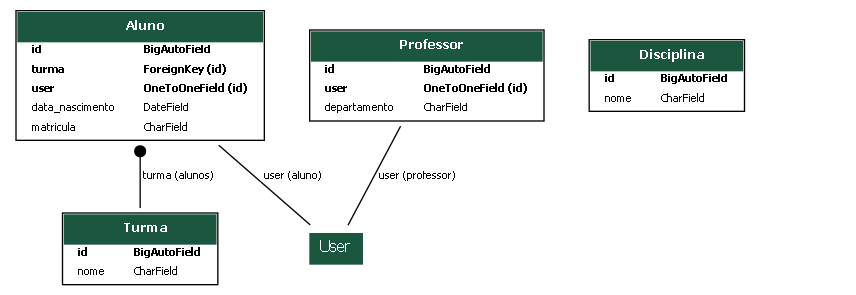

# 📚 Sistema Acadêmico — Projeto Django (Checkpoint 1)

Este projeto é uma aplicação **Django** desenvolvida como parte do trabalho prático da disciplina de **Programação Web**.  
O sistema implementa um modelo acadêmico simples com entidades **Aluno**, **Professor**, **Turma** e **Disciplina**, incluindo a integração com o sistema de usuários padrão do Django (`auth.User`).

---

## 🧩 Objetivo
Desenvolver um sistema web com autenticação e ambiente administrativo para gestão de dados acadêmicos, utilizando o framework Django e boas práticas de modelagem de dados relacionais.

---

## ⚙️ Estrutura do Projeto
```bash
Projeto-Django/
├── code/
│ └── proj_web/
│ ├── manage.py
│ ├── proj_web/
│ │ ├── settings.py
│ │ ├── urls.py
│ │ └── ...
│ ├── myapp/
│ │ ├── models.py # Modelos: Aluno, Professor, Turma, Disciplina
│ │ ├── admin.py # Modelos registrados no admin
│ │ ├── views.py # Views básicas
│ │ ├── urls.py # Rotas da app
│ │ └── templates/ # Páginas HTML simples
│ └── docs/
│ ├── diagram_myapp.png
│ └── modelagem.md
```
---

## 🧠 Modelagem do Domínio
O diagrama a seguir foi gerado automaticamente com `django-extensions`:



Resumo das entidades:

| Entidade | Campos principais | Relacionamentos |
|-----------|------------------|-----------------|
| **Aluno** | `id`, `data_nascimento`, `matricula` | `user` (1:1 `User`), `turma` (N:1 `Turma`) |
| **Professor** | `id`, `departamento` | `user` (1:1 `User`) |
| **Turma** | `id`, `nome` | 1:N com `Aluno` |
| **Disciplina** | `id`, `nome` | sem relacionamentos (isolada) |
| **User** | `username`, `email`, `password` | 1:1 com `Aluno` e `Professor` |

Mais detalhes: [docs/modelagem.md](docs/modelagem.md)

---

## 🧑‍💻 Tecnologias Utilizadas
- **Python 3.12+**
- **Django 5.x**
- **django-extensions** (para geração do diagrama)
- **SQLite3** (banco de dados padrão)
- **Graphviz / PyGraphviz** (renderização do modelo ER)

---

## 🚀 Como Executar Localmente

### 1. Clonar o repositório
```bash
git clone https://github.com/Joaovitor961/Projeto-Django.git
cd Projeto-Django/code/proj_web
```
### 2. Criar e ativar o ambiente virtual
```bash
python -m venv venv
venv\Scripts\activate
```

### 3. Instalar dependências
```bash
pip install -U pip
pip install django django-extensions pygraphviz
```
### 4. Aplicar migrações e criar superusuário
```bash
python manage.py migrate
python manage.py createsuperuser
```

### 5. Rodar o servidor
```bash
python manage.py runserver
```
Acesse http://127.0.0.1:8000/admin
Use o usuário criado no passo anterior.

## 📄 Licença

Este projeto é de uso educacional e faz parte das atividades avaliativas da disciplina Projeto e Implementação de Sistemas.